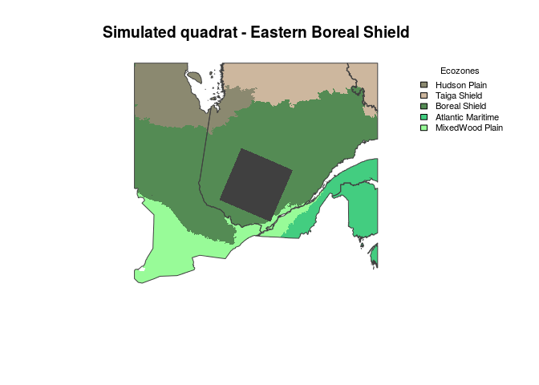
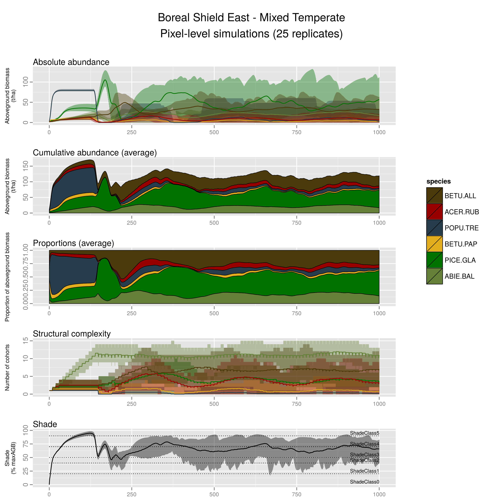

# LANDIS-II Biomass Succession pixel-level simulations: Boreal Shield East - Mixed Temperate
Dominic cyr  
Updated on Oct 27 2015

-------


### Context

This document presents pixel-level simulations of one specific land type chosen among the 80 land types defined for that quadrat. It was subjectively chosen among the most common land types to represent one general type of ecosystem.

We use such pixel-level simulation to assess the realism of emerging succession as simulated by _LANDIS-II Biomass Succession_, to minimise biases and document remaining ones.




-------

### Boreal Shield East - Mixed Temperate


For that type of ecosystem, the following species were included.

1. Balsam Fir (ABIE.BAL)
2. White Spruce (PICE.GLA)
3. White Birch (BETU.PAP)
4. Trembling Aspen (POPU.TRE)
5. Red Maple (ACER.RUB)
6. Yellow Birch (BETU.ALL)


* In the figure below, note that some panels present average values AND enveloppes, while others only present average values.

* The number of cohorts lumped into 10-yrs age classes is used as a proxy for **structural complexity**. That is only an indicator as some cohorts may be present in negligible amounts, especially those that established under already dense canopy.

* In _LANDIS-II Biomass Succession_ the percentage of maximum aboveground biomass occupied thoughout the simulation is used as a **proxy for shade**. Shade thresholds must be defined by the user to create shade classes that may limit the establishment of species based on their shade tolerance. The shade tolerance and other important traits of all species included in landscape-scale simulations are presented in the table below. As our simulations are currently parameterized, a given species establishment becomes limited when site shade classe reaches a value equal to shade tolerance of that species. Establishement becomes impossible when shade class exceed it.

-------

### Simulation setup

* A combination of 5 or 6 species start to growth from bare ground and interact for 1000 years with unlimited seed supply. The emerging succession is presented below.

* The pixel size is 6.25 ha. (250-m resolution)

* No disturbances occur in those simulations.

* One cohort of each species is established at the beginning of each simulation. That is important to consider as that may differ from what mostly occur in nature, where cohort establishment may be delayed for some species, especially after large-scale disturbances and where species are distributed in highly contageous manners.

* Because seed sources are not limiting in those simulations, any locally extinct species can come back later in the simulations.

-------

### Pixel-level simulation results



-------

### Simulated species

Only a subset of the following are included in the pixel-level simulations presented above. However, the following listed species are all those included in landscape-level simulations.


```
##                       CommonName MaxLongevity SexualMaturity
## ABIE.BAL              Balsam fir          150             30
## ACER.RUB               Red maple          150             10
## ACER.SAH             Sugar maple          300             40
## BETU.ALL            Yellow birch          300             40
## BETU.PAP             White birch          150             20
## FAGU.GRA                   Beech          250             40
## LARI.LAR                Tamarack          150             40
## PICE.GLA            White spruce          200             30
## PICE.RUB              Red spruce          300             30
## PICE.MAR            Black spruce          200             30
## PINU.BAN               Jack pine          150             20
## PINU.RES                Red pine          200             40
## PINU.STR      Eastern white pine          300             20
## POPU.TRE         Trembling aspen          150             20
## QUER.RUB                 Red oak          250             30
## THUJ.SPP.ALL Eastern white-cedar          300             30
## TSUG.CAN         Eastern hemlock          300             60
##              ShadeTolerance
## ABIE.BAL                  5
## ACER.RUB                  3
## ACER.SAH                  5
## BETU.ALL                  3
## BETU.PAP                  2
## FAGU.GRA                  5
## LARI.LAR                  1
## PICE.GLA                  3
## PICE.RUB                  4
## PICE.MAR                  4
## PINU.BAN                  1
## PINU.RES                  2
## PINU.STR                  3
## POPU.TRE                  1
## QUER.RUB                  3
## THUJ.SPP.ALL              5
## TSUG.CAN                  5
```
