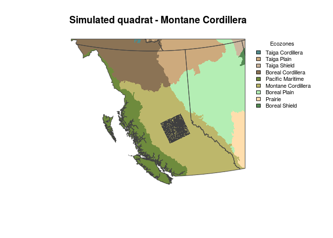
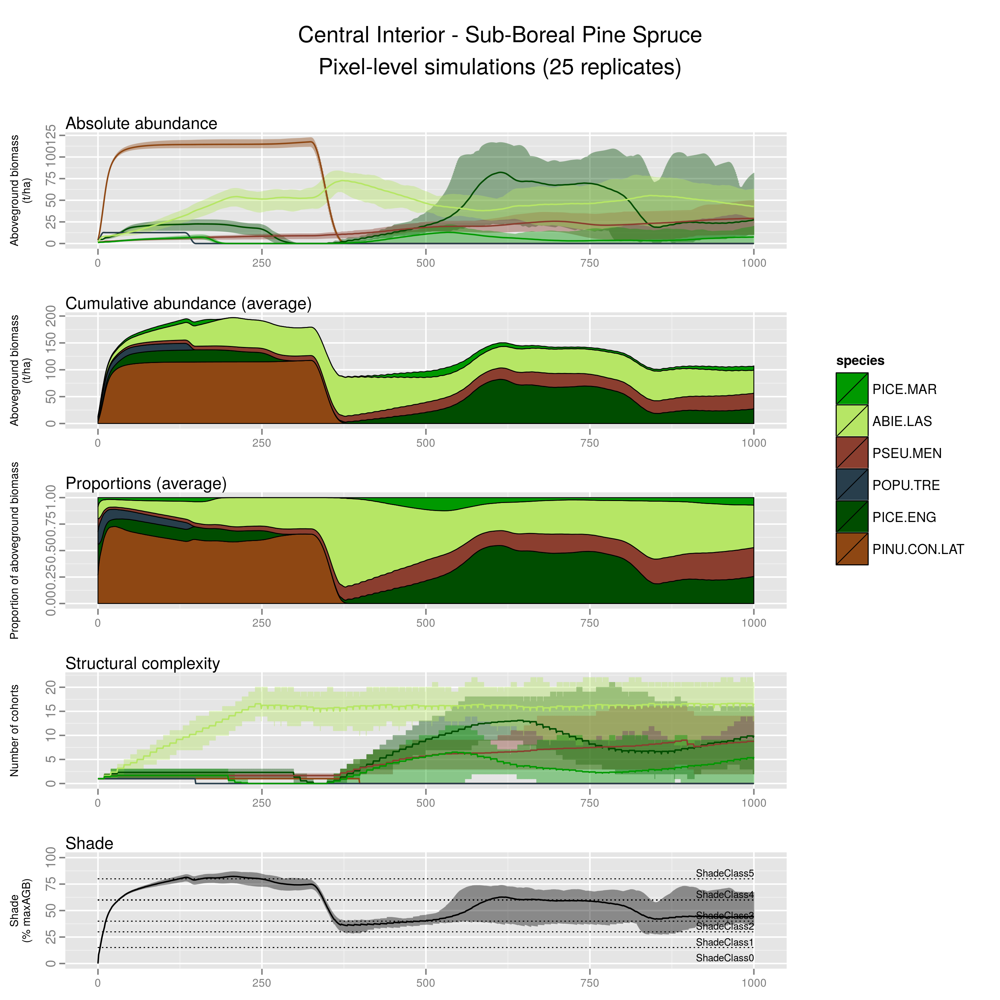

# LANDIS-II Biomass Succession pixel-level simulations: Central Interior - Sub-Boreal Pine-Spruce (preliminary results)
Dominic cyr  
October 26, 2015  

### Simulation setup

* A combination of 5 or 6 species start to growth from bare ground and interact for 1000 years with unlimited seed supply. The emerging succession is presented below.

* One cohort of each species is established at the beginning of each simulation. That is important to consider as that may differ from what mostly occur in nature, where cohort establishment may be delayed for some species, especially after large-scale disturbances and where species are distributed in highly contageous manners.

* Because seed sources are not limiting in those simulations, any locally extinct species can come back later in the simulations.

### Central Interior - Sub-Boreal Pine-Spruce Ecosystem

For that type of ecosystem, the following species, in approximate decreasing order of importance in the present landscape for this land type.

1. Lodgepole Pine (PIN.CON.LAT)
2. Spruces (PICE.ENG, but include all types of spruces except Black Spruce)
3. Aspen (POPU.TRE)
4. Douglas-fir (PSEU.MEN)
5. Alpine fir (ABIE.LAS)
6. Black Spruce (PICE.MAR)

