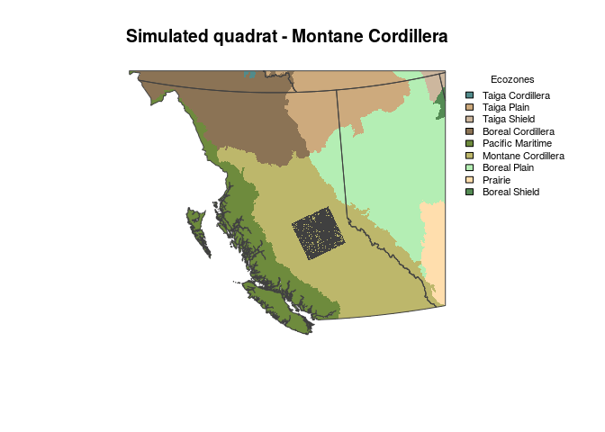
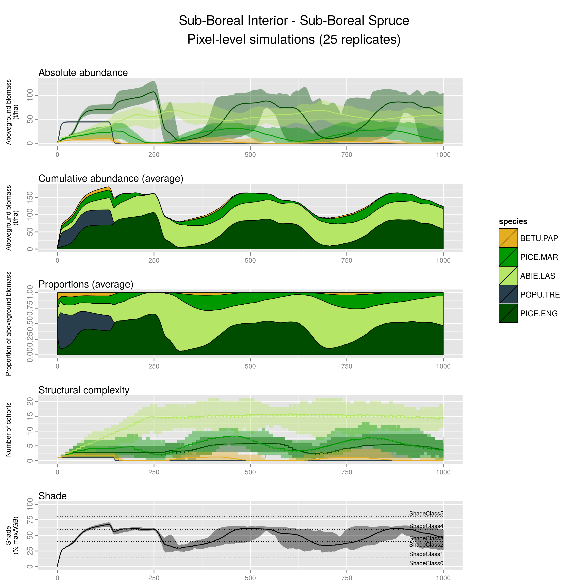

# LANDIS-II Biomass Succession pixel-level simulations: Sub-Boreal Interior - Sub-Boreal Spruce (preliminary results)
Dominic cyr  
Updated on Oct 27 2015

-------


### Context

This document presents pixel-level simulations of one specific land type chosen among the 64 land types defined for that quadrat. It was subjectively chosen among the most common land types to represent one general type of ecosystem.

We use such pixel-level simulation to assess the realism of emerging succession as simulated by _LANDIS-II Biomass Succession_, to minimise biases and document remaining ones.




-------

### Sub-Boreal Interior - Sub-Boreal Spruce


For that type of ecosystem, the following species were included.

1. Spruces (PICE.ENG, but includes all types of spruces except Black Spruce)
2. Aspen (POPU.TRE)
3. Alpine fir (ABIE.LAS)
4. Black Spruce (PICE.MAR)
5. White Birch (BETU.PAP)

* In the figure below, note that some panels present average values AND enveloppes, while others only present average values.

* The number of cohorts lumped into 10-yrs age classes is used as a proxy for **structural complexity**. That is only an indicator as some cohorts may be present in negligible amounts, especially those that established under already dense canopy.

* In _LANDIS-II Biomass Succession_ the percentage of maximum aboveground biomass occupied thoughout the simulation is used as a **proxy for shade**. Shade thresholds must be defined by the user to create shade classes that may limit the establishment of species based on their shade tolerance. The shade tolerance and other important traits of all species included in landscape-scale simulations are presented in the table below. As our simulations are currently parameterized, a given species establishment becomes limited when site shade classe reaches a value equal to shade tolerance of that species. Establishement becomes impossible when shade class exceed it.

-------

### Simulation setup

* A combination of 5 or 6 species start to growth from bare ground and interact for 1000 years with unlimited seed supply. The emerging succession is presented below.

* One cohort of each species is established at the beginning of each simulation. That is important to consider as that may differ from what mostly occur in nature, where cohort establishment may be delayed for some species, especially after large-scale disturbances and where species are distributed in highly contageous manners.

* Because seed sources are not limiting in those simulations, any locally extinct species can come back later in the simulations.

-------

### Pixel-level simulation results



-------

### Simulated species

Only a subset of the following are included in the pixel-level simulations presented above. However, the following listed species are all those included in landscape-level simulations.


```
##                                 CommonName MaxLongevity SexualMaturity
## ABIE.LAS     Subalpine fir (or alpine fir)          250             20
## BETU.PAP                       White birch          150             20
## LARI.OCC                     Western larch          900             25
## PICE.ENG                  Engelmann spruce          300             30
## PICE.MAR                      Black spruce          200             30
## PINU.CON.LAT                Lodgepole pine          400             15
## PINU.PON                    Ponderosa pine          700             15
## POPU.TRE                   Trembling aspen          150             20
## PSEU.MEN                       Douglas-fir          900             25
## THUJ.PLI                  Western redcedar          900             25
## TSUG.HET                   Western hemlock          475             25
## TSUG.MER                  Mountain hemlock          700             20
##              ShadeTolerance
## ABIE.LAS                  5
## BETU.PAP                  2
## LARI.OCC                  1
## PICE.ENG                  4
## PICE.MAR                  4
## PINU.CON.LAT              1
## PINU.PON                  2
## POPU.TRE                  1
## PSEU.MEN                  3
## THUJ.PLI                  5
## TSUG.HET                  5
## TSUG.MER                  4
```
